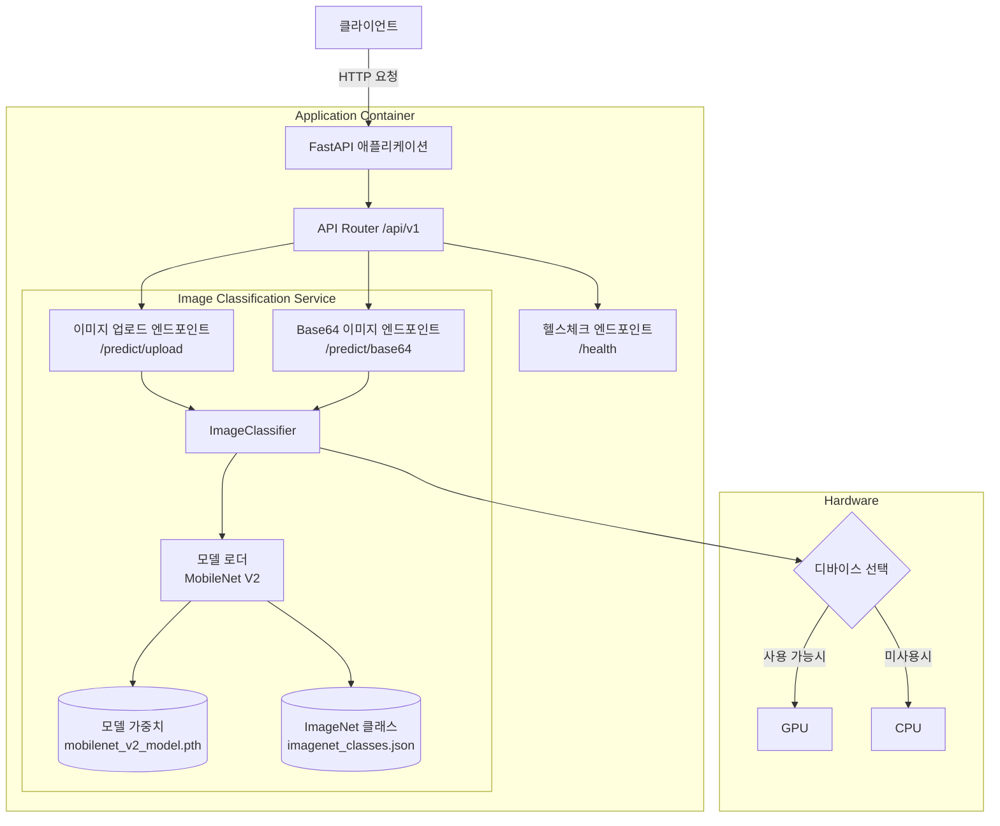

# MobileNet Image Classifier API

FastAPI 기반의 이미지 분류 서비스로, MobileNet V2 모델을 사용하여 이미지를 분류합니다. Docker와 Poetry를 활용한 현대적인 개발 환경을 제공합니다.

## 기술 스택
- **Python**: 3.10 - 3.13 지원
- **Framework**: FastAPI
- **ML Model**: MobileNet V2 (PyTorch)
- **Package Manager**: Poetry
- **Containerization**: Docker & Docker Compose

## 시스템 아키텍처


## 프로젝트 구조
```
.
├── app/                    # 메인 애플리케이션 패키지
│   ├── __init__.py         # FastAPI 앱 초기화
│   ├── api/                # API 엔드포인트
│   │   └── endpoints.py    # API 라우터 및 핸들러
│   ├── models/             # 모델 관련 코드
│   │   └── classifier.py   # MobileNet 분류기 구현
│   └── schemas/            # Pydantic 스키마
│       └── request_response.py # 요청/응답 모델
├── imagenet_classes.json   # ImageNet 클래스 레이블 (1000개 클래스)
├── mobilenet_v2_model.pth  # 사전 학습된 MobileNet V2 모델 가중치
├── mobilenet_classifier.py # 스탠드얼론 분류기 (테스트용)
├── sample1.png             # 테스트용 샘플 이미지
├── requirements.txt        # pip 의존성 파일 (Poetry에서 생성)
├── pyproject.toml          # Poetry 프로젝트 설정
├── poetry.lock             # Poetry 의존성 잠금 파일
├── Dockerfile              # Docker 이미지 정의 (Python 3.10 기반)
├── docker-compose.yml      # Docker Compose 설정
├── .dockerignore           # Docker 빌드 제외 파일
├── .gitignore              # Git 제외 파일
└── README.md               # 프로젝트 문서
```

## 주요 API

### 1. 서버 상태 확인
**Request:**
```http
GET /api/v1/health
```

### 2. 이미지 업로드로 분류
**Request:**
```http
POST /api/v1/predict/upload
```

### 3. Base64 인코딩된 이미지로 분류
**Request:**
```http
POST /api/v1/predict/base64
```
**Request Body:**
```json
{
  "image": "base64_encoded_image_string",
  "top_k": 5
}
```

## 요구사항
- **Python**: 3.10 - 3.13 (3.14 미만, triton 패키지 호환성)
- **Poetry**: 최신 버전 권장
- **Docker**: 선택사항 (컨테이너 실행 시)

## 설치 및 실행 방법

### 1. Poetry를 사용한 설치 (권장)

#### 의존성 설치
```bash
# 프로덕션 의존성만 설치
poetry install --no-root

# 개발 의존성 포함 설치
poetry install --no-root --with dev
```

#### 개발 서버 실행
```bash
# 로컬 접근만 허용
poetry run uvicorn app:app --host 127.0.0.1 --port 8000 --reload

# 외부 접근 허용
poetry run uvicorn app:app --host 0.0.0.0 --port 8000 --reload
```

### 2. requirements.txt 생성 및 pip 사용

#### Poetry에서 requirements.txt 생성
```bash
# 해시 포함 (보안 강화)
poetry export -f requirements.txt --output requirements.txt

# 해시 제외 (간단한 형태)
poetry export -f requirements.txt --output requirements.txt --without-hashes

# 개발 의존성 제외
poetry export -f requirements.txt --output requirements.txt --without-dev --without-hashes
```

#### pip으로 설치 및 실행
```bash
# 가상환경 생성 및 활성화
python -m venv venv
source venv/bin/activate  # Windows: venv\Scripts\activate

# 의존성 설치
pip install -r requirements.txt

# 서버 실행
uvicorn app:app --host 0.0.0.0 --port 8000 --reload
```

### 3. Docker 환경에서 실행

#### Docker Compose 사용 (권장)
```bash
# 빌드 및 실행
docker-compose up --build

# 백그라운드 실행
docker-compose up --build -d

# 서비스 중지
docker-compose down
```

#### Docker 직접 사용
```bash
# 이미지 빌드
docker build -t mobilenet-classifier .

# 컨테이너 실행 (볼륨 마운트 없이)
docker run -p 8000:8000 mobilenet-classifier

# 백그라운드 실행
docker run -d -p 8000:8000 --name mobilenet-api mobilenet-classifier
```

### 4. 스탠드얼론 분류기 테스트
```bash
# Poetry 환경에서
poetry run python mobilenet_classifier.py

# 또는 직접 실행
python mobilenet_classifier.py
```

## 주요 의존성
- **FastAPI**: 웹 프레임워크
- **PyTorch**: 딥러닝 프레임워크 (2.6.0+)
- **torchvision**: 컴퓨터 비전 유틸리티 (0.21.0+)
- **Pillow**: 이미지 처리 라이브러리
- **OpenCV**: 컴퓨터 비전 라이브러리 (opencv-python)
- **Uvicorn**: ASGI 서버
- **python-multipart**: 파일 업로드 지원

## API 접근 방법

서버 실행 후 다음 URL들을 통해 API에 접근할 수 있습니다:

- **API 문서**: http://localhost:8000/docs (Swagger UI)
- **대체 문서**: http://localhost:8000/redoc (ReDoc)
- **헬스체크**: http://localhost:8000/api/v1/health
- **루트**: http://localhost:8000 (자동으로 /docs로 리다이렉트)

## 트러블슈팅

### Poetry 관련 문제
```bash
# poetry.lock 파일과 pyproject.toml 불일치 시
poetry lock

# 가상환경 재생성
poetry env remove python
poetry install --no-root
```

### Docker 관련 문제
```bash
# 이미지 강제 재빌드
docker-compose up --build --force-recreate

# 볼륨 정리
docker-compose down -v
docker system prune -f
```

### Docker 이미지 관리
```bash
# 특정 이미지 삭제
docker rmi mobilenet-classifier:latest

# 모든 이미지 강제 삭제
docker rmi -f $(docker images -aq)

# 사용하지 않는 이미지만 삭제
docker image prune

# 모든 Docker 리소스 정리 (이미지, 컨테이너, 네트워크, 볼륨)
docker system prune -a

# 현재 이미지 목록 확인
docker images
```

### Docker Compose 이미지 관리
```bash
# Docker Compose 관련 이미지 확인
docker-compose images

# Docker Compose로 생성된 로컬 이미지만 삭제 (권장)
docker-compose down --rmi local

# Docker Compose 관련 모든 이미지 삭제 (베이스 이미지 포함)
docker-compose down --rmi all

# 완전 정리: 컨테이너, 네트워크, 이미지, 볼륨, 고아 컨테이너 모두 삭제
docker-compose down --rmi all --volumes --remove-orphans

# Docker Compose 서비스 상태 확인
docker-compose ps
```

### 모델 로딩 문제
- `mobilenet_v2_model.pth` 파일이 프로젝트 루트에 있는지 확인
- `imagenet_classes.json` 파일이 존재하는지 확인
- Python 버전이 3.10-3.13 범위에 있는지 확인


