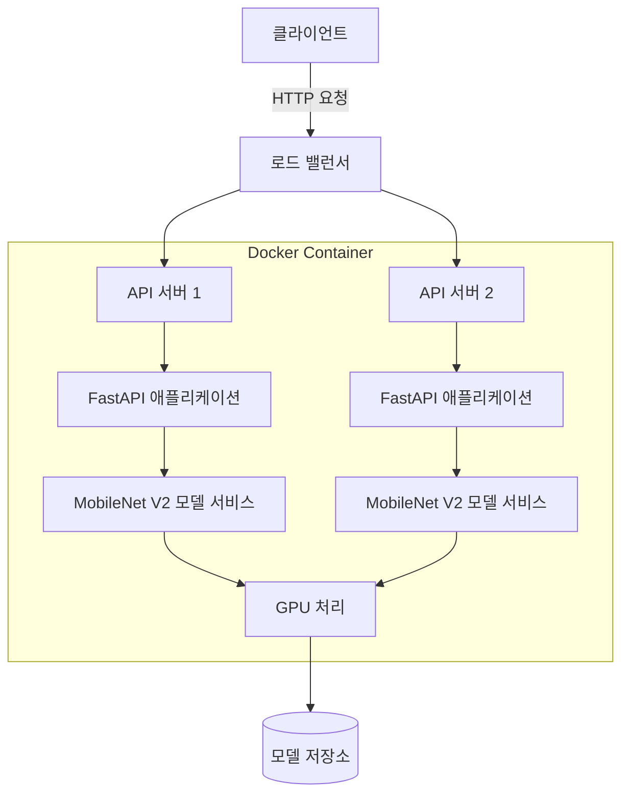

# 프로젝트 개요
이 프로젝트는 FastAPI 기반의 이미지 분류 서비스로, MobileNet V2 모델을 사용합니다. Docker를 활용한 컨테이너화로 손쉽게 배포 및 확장이 가능합니다.

## 시스템 아키텍처


## 프로젝트 구조
```
.
├── app/                    # 메인 애플리케이션 패키지
│   ├── __init__.py         # FastAPI 앱 초기화
│   ├── api/                # API 엔드포인트
│   │   ├── __init__.py
│   │   └── endpoints.py    # API 라우터 및 핸들러
│   ├── models/             # 모델 관련 코드
│   │   ├── __init__.py
│   │   └── classifier.py   # MobileNet 분류기 구현
│   └── schemas/            # Pydantic 스키마
│       ├── __init__.py
│       └── request_response.py # 요청/응답 모델
├── static/                 # 정적 파일
│   └── favicon.ico         # 파비콘
├── tests/                  # 테스트 코드
├── docker/                 # Docker 관련 파일
├── scripts/                # 유틸리티 스크립트
├── imagenet_classes.json   # ImageNet 클래스 레이블
├── mobilenet_v2_model.pth  # 사전 학습된 모델 가중치
├── pyproject.toml          # Poetry 프로젝트 설정
├── poetry.lock             # Poetry 의존성 잠금 파일
├── Dockerfile              # Docker 이미지 정의
├── docker-compose.yml      # Docker Compose 설정
├── .dockerignore           # Docker 빌드 제외 파일
└── README.md               # 프로젝트 문서
```

## 주요 API

### 1. 서버 상태 확인
**Request:**
```http
GET /api/v1/health
```

### 2. 이미지 업로드로 분류
**Request:**
```http
POST /api/v1/predict/upload
```

### 3. Base64 인코딩된 이미지로 분류
**Request:**
```http
POST /api/v1/predict/base64
```
**Request Body:**
```json
{
  "image": "base64_encoded_image_string",
  "top_k": 5
}
```

## 설치 및 실행 방법

### 1. 의존성 설치
```bash
poetry install
```

### 2. requirements.txt 생성
```bash
poetry export -f requirements.txt --output requirements.txt --without-hashes
```

### 3. 개발 서버 실행
```bash
poetry run uvicorn app:app --host 0.0.0.0 --port 8000 --reload
```

### 4. Docker 환경에서 실행

#### 개발 환경
```bash
docker compose up --build
```

#### 프로덕션 환경
```bash
docker compose -f docker-compose.yml -f docker-compose.prod.yml up -d
```

## 기여
기여를 원하시면 Pull Request를 보내주세요. 버그 신고나 제안 사항은 Issue로 등록해 주세요.

## 라이센스
이 프로젝트는 MIT 라이센스를 따릅니다.


